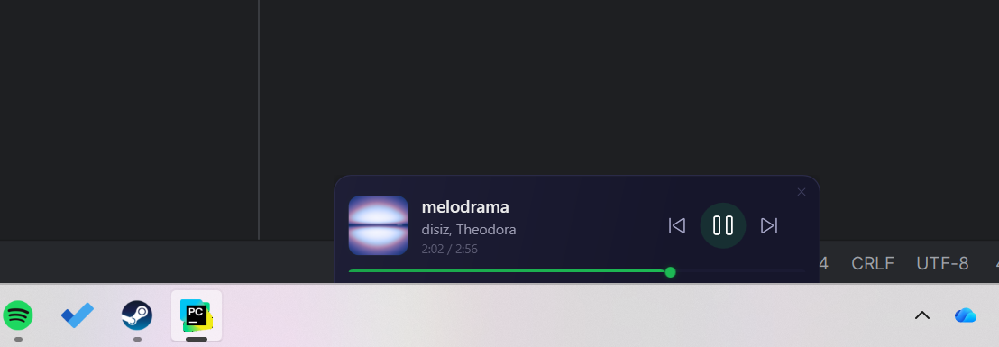
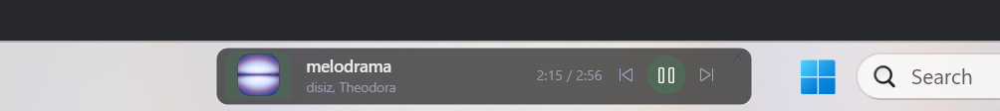

#  SpotifyDock

A sleek little Spotify mini-player that lives on your Windows taskbar. See what's playing, skip tracks, and seek through songs without ever leaving what you're doing.

Built with **C# / WPF / .NET 8**.

## What it looks like

**Floating** — drag it anywhere on your screen


**Docked above taskbar** — snaps right above your taskbar with a compact layout



**On taskbar** — sits directly inside your taskbar as a slim pill



## What it does

- Shows **album art**, track name, artist, and a live progress bar
- **Play/pause, skip, previous** with instant response (no waiting for the API)
- **Click anywhere on the progress bar** to seek
- **Smooth progress** that updates every 100ms (not choppy 2-second jumps)
- **Three dock modes** — just drag the window to switch between them
- **Always on top** of the Windows taskbar
- **Remembers your login** with encrypted token storage

## Getting started

You can use the app in [releases](https://github.com/NhkI0/SpotifyDock/releases) but keep in mind that I might cut it any time if I get rate limited by spotify.

So the best way of using it is by building your own.

### You'll need

- Windows 10 or 11
- [.NET 8 SDK](https://dotnet.microsoft.com/download/dotnet/8.0)
- The [Spotify desktop app](https://www.spotify.com/download/) running and logged in
- A free [Spotify Developer](https://developer.spotify.com/dashboard) app with:
  - **Redirect URI** set to `http://127.0.0.1:5543/callback`
  - **Web API** enabled

### Run it

```bash
git clone https://github.com/NhkI0/SpotifyDock.git
cd SpotifyDock
```

Open `Services/SpotifyAuthService.cs` and paste in your Spotify Client ID, then:

```bash
dotnet run
```

Click **Connect** in the window, authorize with Spotify, and you're good to go.

### Ship it as a standalone exe

```bash
dotnet publish -c Release -r win-x64 --self-contained true -p:PublishSingleFile=true -p:PublishTrimmed=true
```

This spits out a single `SpotifyDock.exe` (~30 MB) that runs on any Windows PC — no .NET install needed. Find it in `bin/Release/net8.0-windows/win-x64/publish/`.

## Project structure

```
SpotifyDock/
  Models/TrackInfo.cs             # Track data model
  Services/
    SpotifyAuthService.cs         # OAuth2 PKCE authentication
    SpotifyPlayerService.cs       # Spotify API polling
    MediaKeyService.cs            # Media key simulation
  ViewModels/PlayerViewModel.cs   # MVVM ViewModel
  Converter.cs                    # WPF value converters
  MainWindow.xaml / .xaml.cs      # UI layout and docking logic
  App.xaml / .xaml.cs             # Global styles and app entry point
```

## Built with

- [CommunityToolkit.Mvvm](https://github.com/CommunityToolkit/dotnet) — MVVM source generators
- [SpotifyAPI-NET](https://github.com/JohnnyCrazy/SpotifyAPI-NET) — Spotify Web API client
- [InputSimulatorCore](https://www.nuget.org/packages/InputSimulatorCore) — media key simulation
- **Win32 P/Invoke** — window z-order and taskbar docking

## Contact
Ask for features or tell me about bugs => @nhankio on Discord